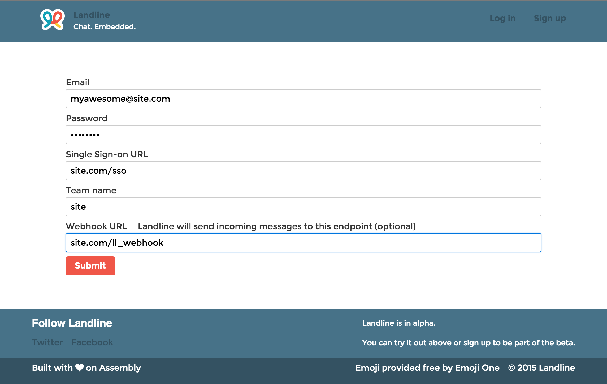

1. Create an account.

    

    Your team name needs to be unique across all Landline teams. If you suspect that someone is squatting on a team name that should be yours, let us know and we'll sort it out.

    Don't be intimidated by the **single sign-on URL** field &mdash; we'll walk you through it. For now, just choose a sensible path on your domain (we recommend `/sso`, but `/my/very/special/route/v3` works just as well) &mdash; you can always change it later.

2. You should be redirected to [https://landline.io/settings](https://landline.io/settings); if not, go there.

    

    You can edit any of your settings here.

    Note the **shared secret** field: Landline generated this for you automatically, and you can feel free to use it or change it. Whatever you do, make sure you keep it safe. If it ends up, for example, getting committed to a public repository, you should change it right away (and then update your `.gitignore`, [ya dingus](https://www.youtube.com/watch?v=9mpU1uFrvgQ&t=0m4s)).

3. [Set up SSO on your server](2-set-up-sso.html).
