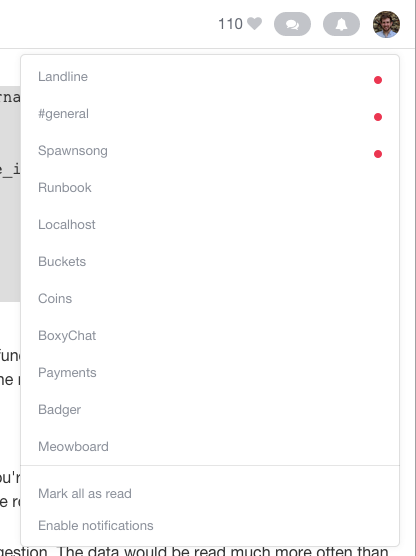

This guide assumes that you've already created an account on [landline.io](https://landline.io) &mdash;. It might also be helpful to take a look at the [quick start]({{ site.baseurl }}/quick-start.html).

Now that you've got Landline set up in an `<iframe>` on your site, you might be wondering how to extend the built-in notifications for your users. Maybe you want to provide them something like this:



To get started, you'll need to authenticate with Landline using the single sign-on flow. Assuming that you SSO [set up on your server]({{ site.baseurl }}/quick-start.html#set-up-sso) and included `<script src="https://cdnjs.cloudflare.com/ajax/libs/socket.io/1.3.5/socket.io.min.js"></script>` (which exposes the `io` global) somewhere on your page:

```javascript
// This code is just a simple example; it's not quite
// production-level code, nor is it meant to be. The methods we're
// demonstrating, in order of execution:
// - logInToLandline()
// - getInitialRooms(token)
// - setUpSocket(token)

function logInToLandline() {
  $.ajax({
    url: `https://landline.io/sessions/new?team=${your_team_name}`
    success: function(result) {
      // Tokens expire in three days; should be plenty of time
      // for your user's session.
      var expiration = result.expiration;
      var token = result.token;

      getInitialRooms(token);
      setUpSocket(token);
    },
    error: function(err) {
      console.log(err);
    }
  });
}

function getInitialRooms(token) {
  $.ajax({
    url: 'https://landline.io/rooms',
    method: 'GET',
    headers: {
      Authorization: 'Bearer ' + token,
      'Content-Type': 'application/json',
    },
    dataType: 'json',
    success: function(result) {
      // A successful request will yield a JSON object
      // with `memberships` (a list of IDs of rooms to which the
      // user is subscribed), `rooms` (a list of your team's room
      // objects), and `unread_rooms` (a list of IDs of rooms in
      // which the user has unread messages) fields. Do with these
      // what you need to do.
      var memberships = result.memberships;
      var rooms = result.rooms;
      var unreadRooms = result.unread_rooms;

      handleInitialRooms(memberships, rooms, unreadRooms);
    },
    error: function(jqXhr, textStatus) {
      console.log(textStatus);
    }
  });
}

function setUpSocket(token) {
  var socket = io('https://landline.io');
  // the connection will be confirmed asynchronously
  socket.on('connect', function() {
    // you'll need to emit an `'auth'` event with the token
    // you received in the response to the first request
    socket.emit('auth', token, function(response) {
      if (response.success) {
        // Landline emits both the message and the room's
        // name when a message is created
        this.socket.on('message', function(message, roomName) {
          // use the `created_at` field on the message so that // you can dismiss notifications based on the time
          // that they were checked
          var createdAt = message.created_at;

          // you'd implement this function yourself, depending
          // on how you handle unreads
          markRoomAsUnread(roomName, createdAt);
        });
      } else {
        // figure out why the response failed and fix it --
        // is your token expired?
        console.log(response);
      }
    });
  });
}
```

And it's as easy as that.
