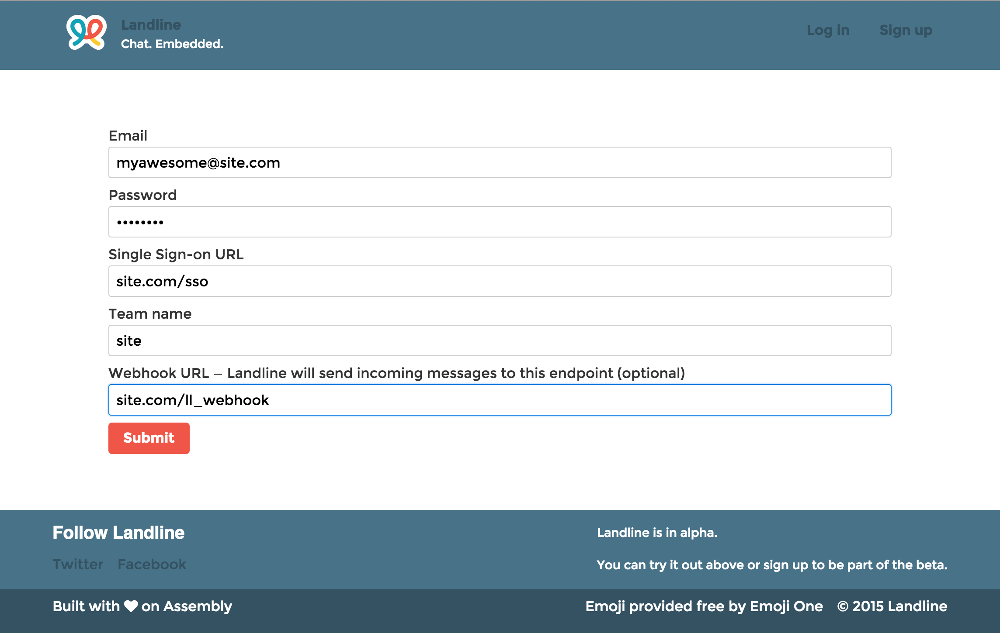
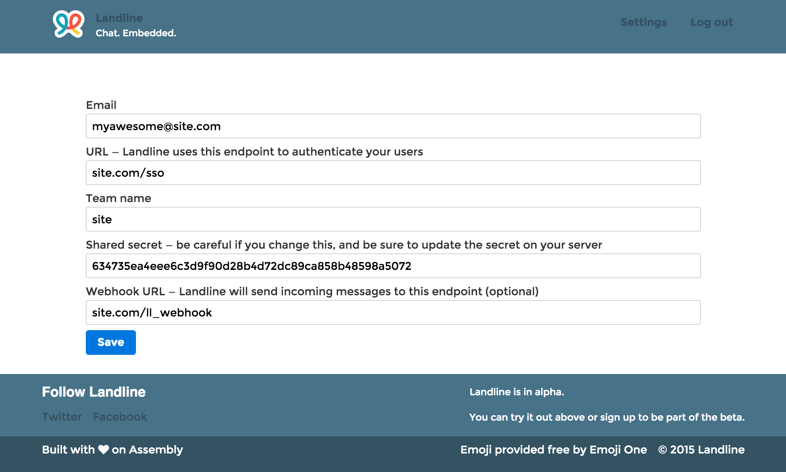

<a name="get-started"></a>
### 1. Create an account

- Go to [https://landline.io/signup](https://landline.io/signup).

    

    Your team name needs to be unique across all Landline teams. If you suspect that someone is squatting on a team name that should be yours, let us know and we'll sort it out.

    Don't be intimidated by the **single sign-on URL** field &mdash; we'll walk you through it. For now, just choose a sensible path on your domain (we recommend `/sso`, but `/my/very/special/route/v3` works just as well) &mdash; you can always change it later.

- Once you've successfully created an account, you'll be redirected to [https://landline.io/settings](https://landline.io/settings).

    

    You can edit any of your settings here.

    Note the **shared secret** field: Landline generated this for you automatically, and you can feel free to use it or change it. Whatever you do, make sure you keep it safe. If it ends up, for example, getting committed to a public repository, you should change it right away (and then update your `.gitignore`, [ya dingus](https://www.youtube.com/watch?v=9mpU1uFrvgQ&t=0m4s)).

<a name="set-up-chat"></a>
### 2. Set up your chat client

Setting up your chat client couldn't be easier:

- Simply include the following `<iframe>` where you'd like your chat to appear (the example below uses [ERB](http://ruby-doc.org/stdlib-2.2.1/libdoc/erb/rdoc/ERB.html); examples in other templating languages are coming soon):

    ```
    <!-- Minimally, you'll need to tell Landline your team name. -->
    <!-- It's recommended that you also tell Landline which room -->
    <!-- you'd like your users to start in (every team gets a    -->
    <!-- "general" room for free; other rooms can be created if  -->
    <!-- needed). -->

    <iframe width="100%"
            height="100%"
            src="<%= ENV['LANDLINE_HOST'] %>/chat?team=your_team_team&room=<%= your_chat_room_name %>
            style="border: none;">
    </iframe>
    ```

<a name="set-up-sso"></a>
### 3. Set up single sign-on on your server

You're almost ready to chat &mdash; you just need to set up single sign-on (which lets you bring your own users to Landline), and you'll be home free.

- Set up your routes.

    Remember how you had to give us a **single sign-on URL**? Here's its chance to shine. If you're using Ruby on Rails, for example, you'll want to add the following line like the following to your `config/routes.rb`:

    ```ruby
      # You'll want to point to your controller and
      # action on the right-hand side of the hash.
      # (You can use SingleSignOnController#sso if
      # you'd like. Really, we won't mind.

      get '/sso' => 'single_sign_on#sso'
    ```

- Set up your controller.

    Here's an [example controller](https://github.com/asm-products/landline-docs/blob/gh-pages/examples/single_sign_on_controller.rb), which you're free to use &mdash; you'll just need to be sure to serialize `current_user` correctly after the redirects. (At Assembly, we pass around a unique token; Landline will wrap up any query params and send them back to your server securely in the redirect (you *are* using SSL, right?), so you can stash whatever you want up there.)

    Using something other than Rails? We're working on more examples, and we'd love [pull requests](https://github.com/asm-products/landline-docs).
