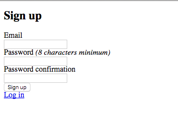

Let's build a simple application that uses Landline to let its users chat. We'll use [Ruby on Rails](http://rubyonrails.org/), as many developers are familiar with the framework. More examples will be coming soon!

This tutorial assumes that you already have a working Rails installation; if you don't, it's probably best that you start there.

Let's initialize a new app in your projects directory

```
$ rails new my-landline
$ cd my-landline
```

We need users, so let's install and configure [Devise](https://github.com/plataformatec/devise).

First, edit your `Gemfile`:

```ruby
gem 'devise'
```

Then:

```
$ bundle
$ rails generate devise:install
```

Familiarize yourself with `config/initializers/devise.rb`. When you're ready, let's generate our user model and some views:

```
$ rails g devise User
$ rails g devise:views
```

Check out `app/models/user.rb`, `db/migrate/{timestamp}_devise_create_users.rb`, and `config/routes.rb`, where Devise has generated your `User` model and added a line for Devise's routes. If that all checks out, let's create the `users` table:

```
$ rake db:migrate
```

Devise asks us to set up a default URL for its mailer in `config/environments/development.rb`:

```ruby
config.action_mailer.default_url_options = { host: 'localhost', port: 3000 }
```


Now you should be able to run `rails s` and navigate to [http://localhost:3000/users/sign_in](http://localhost:3000/users/sign_in) to create an account:



Gorgeous, right?


Next we need to set up a couple of routes. In `routes.rb`, add:

```ruby
root 'chat#index'

get '/sso' => 'single_sign_on#sso'
```

When a user hits the root url, we want to check if they're logged in: if they are, we're going to log them in to Landline; if they aren't, we're going to send them to the sign up page.

Let's set up our controllers to handle those actions and a view to display everything. Create a `ChatController`:

```
$ touch app/controllers/chat_controller.rb
$ mkdir app/views/chat
$ touch app/views/chat/index.html.erb
```

Let's set up `ChatController` first:


```ruby
class ChatController < ApplicationController

  # check if a user is logged in; this is Devise magic
  before_action :authenticate_user!

  def index
  end
end
```

Trying going to [http://localhost:3000](http://localhost:3000) &mdash; you should be redirected to [http://localhost:3000/users/sign_in](http://localhost:3000/users/sign_in).

Go ahead and create an account now. You'll be redirected to [http://localhost:3000](http://localhost:3000) &mdash; and there'll be nothing there.

At this point, you'll need to create an account at [http://dev.landline.io/signup](http://dev.landline.io/signup) (use the development server while you're getting used to everything). While you're doing that, you'll probably wonder what you're supposed to add for the single sign-on URL. That's where `get '/sso' => 'single_sign_on#sso'` in your `routes.rb` comes in &mdash; `http://localhost:3000/sso` will work just fine for now.

Copy the secret that Landline generates for you (or change it, save, and use one of your own making), and head back over to your app. We need to set up some environment variables; from the root directory of your app, run:

```
$ cp .env.sample .env
```

Then fill in `.env` with the team name and secret with which you registered Landline. When you're finished, `.env` should look something like this:

```
LANDLINE_SECRET=your-secret-here
LANDLINE_TEAM=your-team-name-here
LANDLINE_URL=http://landline-dev.herokuapp.com
```

These variables on their own won't do much; add [dotenv](https://github.com/bkeepers/dotenv) to the Gemfile:

```
gem 'dotenv-rails', :groups => [:development, :test]
```

And install it:

```
bundle
```


You're almost ready to chat &mdash; we just need to set up the `SingleSignOnController`. Create that file in your `controllers` folder:

```
touch app/controllers/single_sign_on_controller.rb
```

And set up the class:

```ruby
class SingleSignOnController < ApplicationController
end
```

A full overview of single sign-on techniques is outside of the purview of this tutorial. If you'd like to read more, Landline has followed [Discourse's lead](https://meta.discourse.org/t/official-single-sign-on-for-discourse/13045) for its SSO implementation.

That aside, let's fill out the `SingleSignOnController`:

```ruby
class SingleSignOnController < ApplicationController
  # /sso will be requested from the browser, so we need to set the appropriate
  # CORS headers
  after_filter :set_access_control_headers

  # GET '/sso' is handled here
  def sso
    return render nothing: true, status: 401 unless sign(params[:payload]) == params[:sig]
    return render nothing: true, status: 401 unless nonce = extract_nonce
    return render nothing: true, status: 403 unless current_user = extract_user

    user = Addressable::URI.new
    user.query_values = {
      nonce: nonce,
      team: ENV["LANDLINE_TEAM"],
      id: current_user.id,
      avatar_url: gravatar_url,
      # really, these shouldn't all be the user's email, but it's fine for a
      # quick demo
      username: current_user.email,
      email: current_user.email,
      real_name: current_user.email,
      profile_url: root_url
    }

    payload = Base64.encode64(user.query)
    sig = sign(payload)
    url = "#{ENV["LANDLINE_URL"]}/sessions/sso?payload=#{URI.escape(payload)}&sig=#{sig}"

    redirect_to url
  end

  private

  def decode_payload
    payload = params[:payload]
    raw = Base64.decode64(payload)
    uri = CGI.parse(raw)
  end

  def extract_nonce
    decode_payload["nonce"][0]
  end

  def extract_user
    # NB: In a production app, this wouldn't be acceptable, as users know each
    # other's emails and so could impersonate one another. For now, I'm leaving
    # it as an exercise to the reader to implement a more secure (perhaps
    # token-based) authentication scheme.
    User.find_by(email: decode_payload["user"][0])
  end

  def gravatar_url
    "http://www.gravatar.com/avatar/#{Digest::MD5.hexdigest(current_user.email.downcase)}"
  end

  def sign(payload)
    digest = OpenSSL::Digest.new('sha256')
    OpenSSL::HMAC.hexdigest(digest, ENV["LANDLINE_SECRET"], payload)
  end

  def set_access_control_headers
    headers['Access-Control-Allow-Origin'] = '*'
    headers['Access-Control-Allow-Methods'] = 'GET, POST, DELETE'
    headers['Access-Control-Request-Method'] = '*'
    headers['Access-Control-Allow-Headers'] = 'Origin, Content-Type, Accept'
  end
end
```

Whew. That was a lot. Finally, in `app/views/chat/index.html.erb`, add:

```
<iframe width="100%" height="800px"
  src="http://dev.landline.io/chat?team=<%= ENV['LANDLINE_TEAM'] %>&user=<%= current_user.email %>"
  style="border: none;">
</iframe>
```

And you're set!
